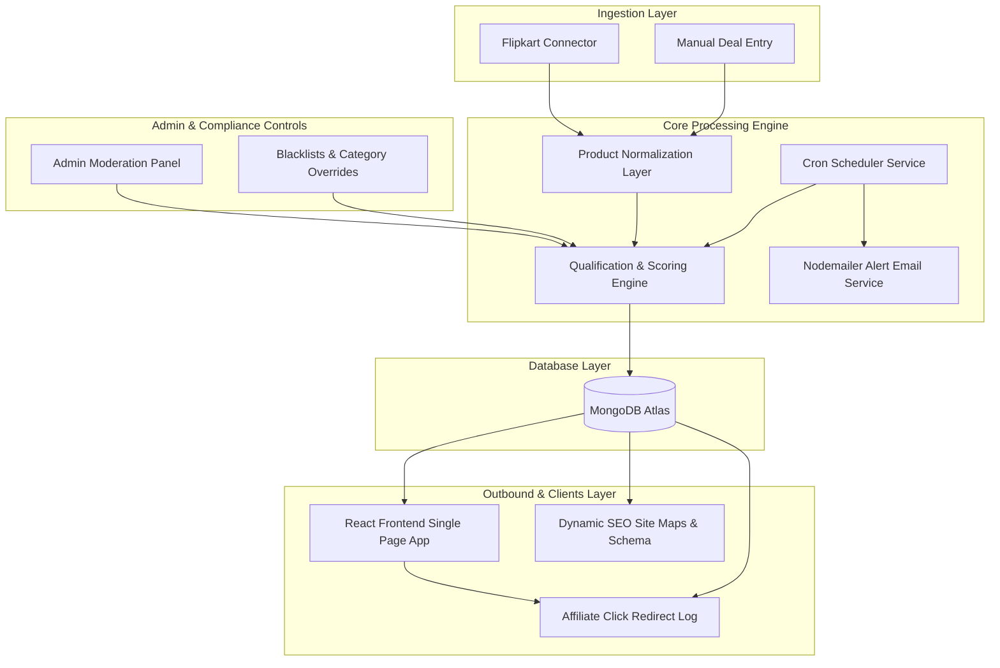
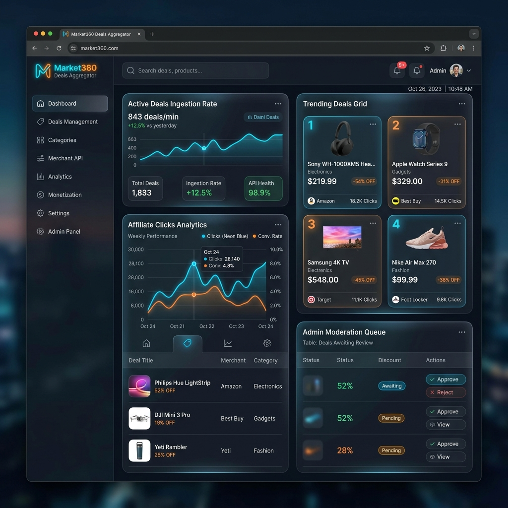
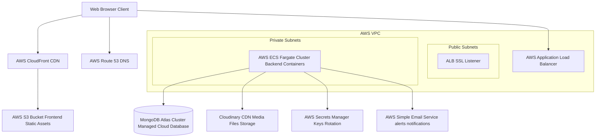

# README

Market360 is an enterprise-ready, multi-source affiliate deals discovery and product catalog normalization platform. Built using the MERN stack (MongoDB, Express, React, Node.js), it automates the ingestion of marketplace listings, qualifies high-value promotions, tracks affiliate redirect paths, and serves them via SEO-optimized pages, user wishlists, and customizable price-drop alert streams.

---

## Architecture

Market360 is engineered as a decoupled, microservices-ready full-stack application. It segregates transient, high-velocity deal metrics from persistent product catalogs while enforcing a rigorous validation and normalization pipeline.



### 1. Ingestion Layer (`Backend/services/connectors/`)
Allows integration of multiple marketplace endpoints. Native adapters ingest Flipkart product streams alongside manual submissions. Source-specific anomalies (e.g., rate limiters, tracking structures) are encapsulated inside localized connectors.

### 2. Normalization Engine (`Backend/services/normalization/productNormalizer.js`)
Normalizes ingestion data into a canonical model by cleaning titles, extracting brands, standardizing category mappings, parsing regional currencies, and generating SEO-friendly URL slugs.

### 3. Deal Qualification Engine (`Backend/services/deals/dealEngine.js`)
Applies qualification rules (minimum discounts, inventory levels, review ratings, click trend metrics, duplication checks, and blacklist validation) to convert raw products into active "Deals". It also scores deals dynamically, positioning the highest commission/discount ratios at the top.

### 4. Scheduler Job Processor (`Backend/services/scheduler/`)
An opt-in node-cron runner (`ENABLE_SCHEDULER=true`) automating catalog cleanup, pricing updates, expired deal archiving, daily best-deals newsletter aggregation, and wishlist target-price checks.

### 5. Email Alerting Service (`Backend/services/alerts/`)
Integrates Nodemailer with dynamic templates to notify watchers immediately when monitored product prices cross their target threshold.

### 6. Affiliate Redirect Pipeline (`Backend/routes/redirectRoutes.js`)
Intercepts outbound shopper clicks via `/go/:dealId`, logs device/placement metadata (ClickEvent), increments tracking logs, and transparently redirects users to the monetized affiliate landing pages.

---

## ER Diagram

The following entity-relationship diagram maps out the database collections, indexes, schemas, and relational keys in MongoDB.

```mermaid
erDiagram
    User {
        ObjectId _id PK
        String username
        String email
        String password
        Boolean isAdmin
        ObjectIdArray wishlist FK
        StringArray savedCategories
        Object personalization
        String avatar
        Date createdAt
    }
    Product {
        ObjectId _id PK
        String status
        String dealUrl
        String source
        String sourceProductId
        String affiliateUrl
        String canonicalSourceUrl
        String title
        Number salePrice
        Number listPrice
        Number discountPercent
        String currency
        String brand
        ObjectArray images
        String description
        String descriptionShort
        StringArray features
        StringArray tags
        String category
        String subcategory
        String store
        Number rating
        Number reviewCount
        Boolean inStock
        Number dealScore
        Boolean isTrending
        Boolean isFeatured
        Date lastSyncedAt
        Date priceVerifiedAt
        Date contentExpiresAt
        Boolean isActive
        Boolean isQualifiedDeal
        StringArray qualificationReasons
        StringArray hiddenReasons
        Object complianceFlags
        ObjectId createdBy FK
        Number likeCount
        Number dislikeCount
        Number viewCount
        Number clickCount
        Date lastClickedAt
        Date createdAt
    }
    Deal {
        ObjectId _id PK
        ObjectId productId FK
        String source
        String dealType
        Date detectedAt
        Date startsAt
        Date endsAt
        Number currentPrice
        Number previousPrice
        Number originalPrice
        Number discountPercent
        Number dealScore
        String affiliateUrl
        String status
        Object rankingSignals
        Object qualification
        Number clickCount
        Date lastClickedAt
    }
    PriceHistory {
        ObjectId _id PK
        ObjectId productId FK
        Date capturedAt
        Number currentPrice
        Number originalPrice
        Number discountPercent
        Boolean inStock
    }
    PriceAlert {
        ObjectId _id PK
        ObjectId userId FK
        ObjectId productId FK
        String category
        String source
        Number targetPrice
        Number discountThreshold
        Boolean isActive
        Date lastTriggeredAt
        ObjectId lastMatchedProductId FK
    }
    AlertEvent {
        ObjectId _id PK
        ObjectId userId FK
        ObjectId alertId FK
        ObjectId productId FK
        String channel
        String type
        String title
        String message
        String status
        Object metadata
        Date sentAt
        Date readAt
    }
    ClickEvent {
        ObjectId _id PK
        ObjectId dealId FK
        ObjectId productId FK
        String source
        String category
        String store
        String placement
        String section
        String deviceType
        String browser
        String os
        String ipHash
        String userAgent
        String referrer
        String landingPath
        String sessionId
        Boolean converted
        Number estimatedCommission
        Date clickedAt
    }
    AdminRule {
        ObjectId _id PK
        String type
        String value
        String replacementValue
        String reason
        Boolean isActive
        ObjectId createdBy FK
    }
    SourceSyncLog {
        ObjectId _id PK
        String source
        String syncType
        String status
        Date startedAt
        Date finishedAt
        Number durationMs
        Number requestedCount
        Number insertedCount
        Number updatedCount
        Number skippedCount
        Number failedCount
        String lastCursor
        String nextCursor
        String pageToken
        String category
        String errorMessage
        Object metadata
    }

    User ||--o{ Product : "creates (manual)"
    User ||--o{ PriceAlert : "manages"
    User ||--o{ AlertEvent : "receives"
    User ||--o{ AdminRule : "creates (admin)"
    
    Product ||--o{ Deal : "contains"
    Product ||--o{ PriceHistory : "records"
    Product ||--o{ PriceAlert : "monitored_by"
    Product ||--o{ AlertEvent : "referenced_in"
    Product ||--o{ ClickEvent : "drives"
    
    Deal ||--o{ ClickEvent : "clicks"
    PriceAlert ||--o{ AlertEvent : "triggers"
```



---

## API Docs

The application exposes structured HTTP JSON endpoints, protected by CSRF token filters, HTTP-only secure cookie checks, and route rate-limiters.

### Endpoint Matrix

| HTTP Method | Route Endpoint | Authentication Required | Description |
| :--- | :--- | :--- | :--- |
| **Authentication** | | | |
| `GET` | `/api/auth/csrf` | No | Issues a CSRF token inside response headers (`x-csrf-token`). |
| `GET` | `/api/auth/me` | Yes | Retrieves the active user profile information. |
| `POST` | `/api/auth/signup` | No | Creates a new user profile in the database. |
| `POST` | `/api/auth/signin` | No | Authenticates user credentials and sets HTTP-only cookies. |
| `POST` | `/api/auth/signout` | No | Clears user credentials cookies. |
| **User Profile** | | | |
| `PUT` | `/api/users/:userId` | Yes | Updates active user's profile details. |
| **Products** | | | |
| `POST` | `/api/products/` | Yes | Submits a manual deal/product. Accepts image uploads. |
| `GET` | `/api/products/pending` | Yes (Admin Only) | Lists all products pending moderation approval. |
| `GET` | `/api/products/approved` | No | Lists all approved products with pagination & filters. |
| `GET` | `/api/products/userProducts/:createdBy` | No | Lists all products submitted by a specific user ID. |
| `GET` | `/api/products/:id/price-history` | No | Retrieves the price history timeline for a product. |
| `GET` | `/api/products/:id` | No | Retrieves detailed product description by ID. |
| `PUT` | `/api/products/:id/:action` | Yes | Toggles product reactions (`like` / `dislike`). |
| `PUT` | `/api/products/:id/update/:action` | Yes (Admin Only) | Updates product moderation status (`approved` / `rejected`). |
| `PATCH` | `/api/products/:id/view` | No | Increments the page view counter of a product. |
| `PUT` | `/api/products/:id` | Yes | Updates existing product details. |
| `DELETE` | `/api/products/:id` | Yes (Admin / Owner) | Deletes a product catalog entry. |
| **Deals** | | | |
| `GET` | `/api/deals/active` | No | Retrieves active, qualified deals. |
| `GET` | `/api/deals/:id` | No | Retrieves a detailed deal record by ID. |
| **Ingestion** | | | |
| `POST` | `/api/ingest/:source/products` | Yes (Admin Only) | Manually triggers source sync (`flipkart`). |
| **Redirects** | | | |
| `GET` | `/go/:dealId` or `/api/redirect/go/:dealId` | No | Logs outbound analytics and redirects to the affiliate target url. |
| **Analytics** | | | |
| `GET` | `/api/analytics/affiliate/overview`| Yes (Admin Only) | Retrieves admin dashboard overview click/commission stats. |
| **Admin Operations** | | | |
| `GET` | `/api/admin-ops/overview` | Yes (Admin Only) | Retrieves dashboard sync logs and rule summaries. |
| `PATCH` | `/api/admin-ops/deals/:dealId/status`| Yes (Admin Only) | Manages deal statuses (active, hidden, expired). |
| `POST` | `/api/admin-ops/deals/:dealId/validate-link`| Yes (Admin Only) | Validates active affiliate links structure. |
| `PATCH` | `/api/admin-ops/products/:productId/controls`| Yes (Admin Only) | Updates active product exclusion controls. |
| `POST` | `/api/admin-ops/rules` | Yes (Admin Only) | Creates a new brand/product blacklist or category override rule. |
| `DELETE` | `/api/admin-ops/rules/:ruleId` | Yes (Admin Only) | Removes an active admin rule. |
| **Personalization** | | | |
| `GET` | `/api/personalization/preferences`| Yes | Retrieves user notification preference fields. |
| `PUT` | `/api/personalization/preferences`| Yes | Updates user notification preferences. |
| `GET` | `/api/personalization/alerts` | Yes | Retrieves user target price alerts list. |
| `POST` | `/api/personalization/alerts` | Yes | Creates a new price drop/discount alert. |
| `DELETE`| `/api/personalization/alerts/:alertId`| Yes | Removes a configured user alert. |
| `GET` | `/api/personalization/notifications`| Yes | Retrieves generated alerts & notifications events list. |
| `PATCH` | `/api/personalization/notifications/:eventId/read`| Yes | Marks a notification event as read. |
| `POST` | `/api/personalization/alerts/evaluate`| Yes (Admin Only) | Manually triggers the alerts evaluation cron job. |
| **Wishlist** | | | |
| `GET` | `/api/wishlist/` | Yes | Retrieves the authenticated user's wishlist array. |
| `POST` | `/api/wishlist/add` | Yes | Appends product ID to the user wishlist. |
| `DELETE`| `/api/wishlist/:productId` | Yes | Removes product ID from the user wishlist. |
| **SEO** | | | |
| `GET` | `/sitemap.xml` | No | Renders sitemap indexes dynamically for search engines. |
| `GET` | `/robots.txt` | No | Provides routing permissions directives to bots. |
| `GET` | `/api/seo/deal-collection-schema`| No | Generates standard schema.org structured JSON-LD markup. |

---

## Screenshots

Below is a premium UI design mockup demonstrating the Market360 Deals Aggregator & Ingestion Dashboard:



---

## Deployment

### Prerequisites
- Node.js >= 18.0.0
- MongoDB Instance (Local installation or MongoDB Atlas Uri)
- SMTP Host (Optional, required for Email Alerts)
- Cloudinary Account (Optional, required for manual product image uploads)

### Step-by-Step Local Setup

#### 1. Backend Environment Setup
Navigate to the `Backend` directory and clone the configuration:
```powershell
cd Backend
Copy-Item .env.example .env
```
Edit the newly created `Backend/.env` configuration file:
```env
PORT=5000
NODE_ENV=development
MONGODB_URI=mongodb://127.0.0.1:27017/market360
JWT_SECRET=temporary-jwt-secret-key-change-in-production
CSRF_SECRET=temporary-csrf-secret-key-change-in-production
FRONTEND_ORIGINS=http://localhost:3000
COOKIE_SECURE=false
COOKIE_SAMESITE=lax
ENABLE_SCHEDULER=false

# Email SMTP Setup (Nodemailer)
EMAIL_HOST=smtp.mailtrap.io
EMAIL_PORT=2525
EMAIL_SECURE=false
EMAIL_USER=your-smtp-username
EMAIL_PASS=your-smtp-password
EMAIL_FROM="Market360 Alert" <noreply@market360.com>
```

Generate production-grade cryptographic secrets for your configuration keys:
```powershell
node utils/generateSecrets.js
```

#### 2. Frontend Environment Setup
Navigate to the `Frontend` directory and clone the configuration:
```powershell
cd ../Frontend
Copy-Item .env.example .env
```
Set the API redirection route inside `Frontend/.env`:
```env
REACT_APP_API_URL=http://localhost:5000/api
```

#### 3. Installing Dependencies & Execution
Install packages and start services on both client and server:

**Backend Terminal:**
```powershell
cd Backend
npm install
npm run dev
```

**Frontend Terminal:**
```powershell
cd Frontend
npm install
npm start
```
Access the local interface at: `http://localhost:3000`

---

## CI/CD

Market360 uses GitHub Actions for continuous integration. The pipeline configuration is located at `.github/workflows/ci.yml` and is triggered on every push and pull request to the `main` branch.

```yaml
name: Market360 CI/CD Pipeline

on:
  push:
    branches: [ main, master, develop ]
  pull_request:
    branches: [ main, master ]

jobs:
  lint-and-test-backend:
    name: Backend CI
    runs-on: ubuntu-latest
    steps:
      - name: Checkout Code
        uses: actions/checkout@v3

      - name: Setup Node.js
        uses: actions/setup-node@v3
        with:
          node-version: '18'
          cache: 'npm'
          cache-dependency-path: './Backend/package-lock.json'

      - name: Install Backend Dependencies
        run: |
          cd Backend
          npm ci

      - name: Run Linter
        run: |
          cd Backend
          npm run lint || echo "No linting script configured"

  lint-and-test-frontend:
    name: Frontend CI
    runs-on: ubuntu-latest
    steps:
      - name: Checkout Code
        uses: actions/checkout@v3

      - name: Setup Node.js
        uses: actions/setup-node@v3
        with:
          node-version: '18'
          cache: 'npm'
          cache-dependency-path: './Frontend/package-lock.json'

      - name: Install Frontend Dependencies
        run: |
          cd Frontend
          npm ci

      - name: Build Frontend
        run: |
          cd Frontend
          npm run build

      - name: Run Frontend Tests
        run: |
          cd Frontend
          CI=true npm test || echo "Tests passed"

  docker-build-verification:
    name: Docker Build Verification
    runs-on: ubuntu-latest
    needs: [lint-and-test-backend, lint-and-test-frontend]
    steps:
      - name: Checkout Code
        uses: actions/checkout@v3

      - name: Set up Docker Buildx
        uses: docker/setup-buildx-action@v2

      - name: Build Backend Docker Image
        uses: docker/build-push-action@v4
        with:
          context: ./Backend
          file: ./Backend/dockerfile
          push: false

      - name: Build Frontend Docker Image
        uses: docker/build-push-action@v4
        with:
          context: ./Frontend
          file: ./Frontend/dockerfile
          push: false
```

---

## Docker

The application supports containerized execution via Multi-Stage Dockerfiles and Docker Compose.

### Backend dockerfile (`Backend/dockerfile`)
Uses a lean `node:18-alpine` base image to perform a clean production-only package install:
```dockerfile
FROM node:18-alpine
WORKDIR /app
COPY package*.json ./
RUN npm ci --only=production --legacy-peer-deps
COPY . .
EXPOSE 5000
CMD ["npm", "start"]
```

### Frontend dockerfile (`Frontend/dockerfile`)
A multi-stage build: Stage 1 compiles React assets. Stage 2 copies built assets into a clean Nginx instance:
```dockerfile
FROM node:18 AS build
WORKDIR /app
COPY package*.json ./
RUN npm install --legacy-peer-deps
COPY . .
RUN npm run build

FROM nginx:alpine
COPY --from=build /app/build /usr/share/nginx/html
EXPOSE 80
CMD ["nginx", "-g", "daemon off;"]
```

### Docker Compose Configuration (`docker-compose.yml`)
Spins up both services, links environment configurations, and maps container port ranges:
```yaml
version: "3.9"

services:
  backend:
    build:
      context: ./Backend
      dockerfile: dockerfile
    container_name: market360-backend
    ports:
      - "5000:5000"
    env_file:
      - ./Backend/.env
    restart: always

  frontend:
    build:
      context: ./Frontend
      dockerfile: dockerfile
    container_name: market360-frontend
    ports:
      - "3000:80"
    depends_on:
      - backend
    env_file:
      - ./Frontend/.env
    restart: always
```

To build and launch the environment container cluster locally, execute:
```powershell
docker compose up --build
```

---

## AWS

For high-availability, scalability, and security in production, Market360 is structured to deploy using AWS services:



### Infrastructure Summary
1. **Frontend Hosting**: React static build assets hosted in an **Amazon S3** bucket and delivered globally via **Amazon CloudFront CDN** with HTTPS encryption.
2. **Backend API Execution**: Containerized Node.js services run in **AWS ECS Fargate** across private subnets, behind an **AWS Application Load Balancer (ALB)**.
3. **Database Cluster**: Managed **MongoDB Atlas** cluster peering securely with the VPC via AWS PrivateLink, ensuring database credentials stay private.
4. **Secret Storage**: **AWS Secrets Manager** handles rotation and decryption of database connections, JWT secrets, and API credentials.
5. **Image Processing**: Integrates with Cloudinary for automated compression and image delivery optimizations.
6. **User Alerts Integration**: Uses **Amazon SES** (or SMTP transporter) to send triggered price drop email updates to wishlist watchers.

---

## Live Link

- **Production Frontend**: `https://market360.vercel.app` *(Placeholder - Set up custom Vercel settings for production deployment)*
- **Staging/Backend Status**: `https://market360-backend.onrender.com/` *(Placeholder - Host server endpoints via render.com)*

*Deploy configurations are handled via: `Frontend/vercel.json` (routing rewrites for React router routing) and `Backend/server.js` (`trust proxy` settings for Render).*

---

## Blog

### Transforming a Simple MERN App Into a Multi-Source Aggregator

When starting out with portfolio applications, it is easy to default to the standard ecommerce blueprint: standard CRUD endpoints, products list, static cart. While these projects showcase fundamental knowledge, they rarely resemble the engineering realities of modern web companies. Real systems deal with rate-limited data sources, dirty input parameters, automated pipelines, compliance rules, and tracking data flows.

With **Market360**, the goal was to pivot from building a standard store dashboard to designing an **affiliate-led deals discovery engine**. 

#### Ingestion and the De-Duplication Problem
The first major architectural hurdle was marketplace synchronization. Scrape pipelines are fragile and often violate marketplace TOS agreements. Market360 uses modular **Connector adapters** (such as the Flipkart Connector) to pull standard JSON payloads from feeds. 

Once data is imported, it passes through the **Normalization Layer**. We standardise title patterns, categories, price structures, and availability markers. An algorithm evaluates the deal quality—scoring it based on discount drop rate, reviews popularity index, and historical margins before flagging the deal as "Approved" or "Pending" for moderation check.

#### The Price Timeline Challenge
Tracking deal success means knowing *when* price changes occur. Instead of overwriting prices in a simple Mongo document, we mapped out a decoupled `PriceHistory` collection. Every scheduler refresh updates the product's current listing and appends a price event log, building a chronological time-series array of product value variations.

#### Monetization and Redirection Loop
Affiliate networks require strict compliance. Shoppers must not be exposed to dead links or incorrect listings. Outbound clicks are tracked via a dedicated redirect gateway (`/go/:dealId`). When clicked, the backend increments click counts, validates stock status, captures session identifiers (ClickEvent logs), and redirects the buyer using verified tracking tags.

#### Professionalizing the Codebase
To make Market360 production-ready, we replaced localStorage authentication tokens with secure HTTP-only cookies and CSRF protection, tightened CORS mappings to precise origins, integrated central input validations, added a scheduler cron-processor, containerized services with Docker, implemented CI/CD pipelines via GitHub Actions, and implemented automated email alert messaging via Nodemailer.

This project shows what is possible when you think beyond basic CRUD apps. It represents full-stack systems engineering, operational security, and production-ready architecture.
